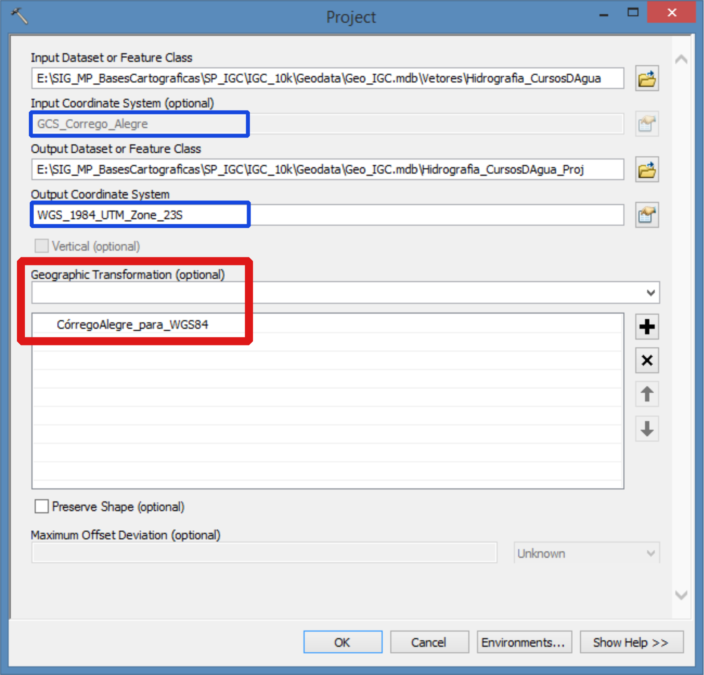

# ArcGIS-Transformation
Cria parâmetros de transformações entre os datum comumente utilizados no Brasil conforme dados oficiais.

## Para que serve?
Existe muita confusão na conversão e projeção de arquivos espaciais (*shapefiles* e *feature class*) no ArcGIS.
Por *default*, o ArcGIS dispõe de 14 maneiras diferentes para converter feições entre SAD69 e WGS84. A versão mais correta para se utilizar é a *SAD_1969_To_WGS_1984_14*.

*E para outros datum? Tais como Córrego Alegre e SIRGAS2000?*
O objetivo desse *script* é facilitar tais conversões, criando no ArcGIS, os parâmetros de transformação corretos, definidos pelo IBGE e outras instituições de pesquisa. Após criados, os parâmetros de transformação estarão disponíveis na ferramenta *Data Management toolbox/**Project***, do *ArcToolBox*, e nos parâmetros de transformação entre datum no mesmo *data-frame*, no **ArcMap**.

## Como "instalar" e usar?
Fazer o *download* (ou cópia) do arquivo [Transformation.py](Transformation.py) e executar.

## Pré-requisitos
- ArcGIS instalado;

Testado com as versões 10.3 e 10.5.

## Autor
* **Michel Metran**, veja [outros projetos](https://michelmetran.com)

Veja também a lista de [colaboradores](https://github.com/michelmetran/ArcGIS-Transformation/settings/collaboration) que auxiliaram nesse projeto.

## Licença
Esse projeto é licenciado sob a 'MIT License'.

Veja o arquivo [LICENSE.md](LICENSE.md) para detalhes.

## Referências
Sobre a [criação de transformações entre datum customizada no ArcGIS](http://desktop.arcgis.com/en/arcmap/10.5/tools/data-management-toolbox/create-custom-geographic-transformation.htm).

Sobre [questões de geodésia definidas pelo IBGE](http://www.ibge.gov.br/home/geociencias/geodesia/pmrg/faq.shtm).

Sobre [transformação entre referenciais geodésicos definidos pela Engenharia Cartográfica da UFRGS](http://www.ufrgs.br/engcart/Teste/refer_exp.html).

Sobre os [parâmetros de transformações entre datum que existem, por *default*, no ArcGIS](http://help.arcgis.com/en/arcgisdesktop/10.0/help/003r/pdf/geographic_transformations.pdf).
